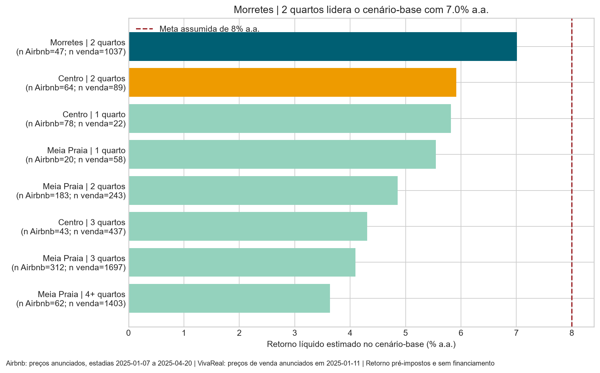
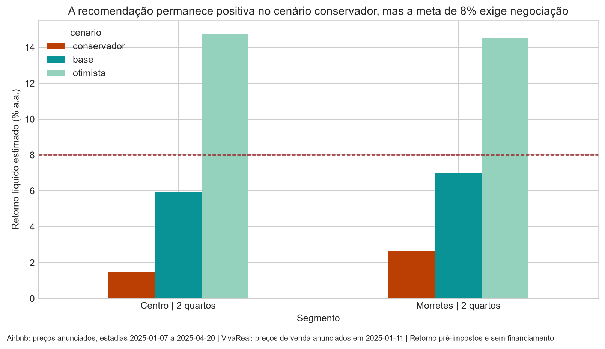

# Hackathon Jovens Talentos AI Builder 2026 — Seazone · Itapema (SC)

▶ **Vídeo da entrega (até 3 min):** `https://drive.google.com/file/d/1bRkLPK5RX_pbehdB_e6FpnUJo-LciDFI/view?usp=sharing`

---

## Resumo executivo

**O que comprar:** apartamento de **2 quartos em Morretes**, na faixa de venda mediana de **R$ 680 mil a R$ 880 mil** (mediana **R$ 790 mil**). Retorno líquido estimado de **7,01% a.a.** no cenário-base, com **payback de 14,3 anos**; cenário conservador **2,66% a.a.** e otimista **14,50% a.a.**

**Condição de compra:** com a meta assumida de **8% a.a.**, o preço máximo que sustenta essa meta é **R$ 691.861** — desconto de **12,4%** sobre a mediana anunciada. Acima desse limite, recomendação de **não comprar ainda** ou revisar a alternativa.

**Alternativa:** **Centro, 2 quartos**, com retorno líquido base de **5,91% a.a.**

**Posição sobre a tese (compactos studio/1Q no Centro):** **refutada** no componente testável. O Centro, 1 quarto, tem boa eficiência bruta (10,04% a.a.), mas não domina os comparáveis nem a grade de sensibilidades (lidera 44,4%); **studios permanecem inconclusivos** por ausência de amostra residencial. Detalhes em `outputs/tese/veredito_tese.md`.

---

## A base técnica por trás da escolha

1. **Melhor perfil (Etapa 3):** o apartamento **4+ quartos / 7+ hóspedes** tem a maior diária mediana anunciada — **R$ 988/noite** (n=70). É o destaque de potencial bruto, porém exige aporte e custos maiores; no retorno líquido comparado (Etapa 5) perde para o **2 quartos**, que equilibra diária relevante e preço de entrada menor.
2. **Melhor localização:** **Meia Praia** lidera a diária bruta (R$ 589/noite, n=607); após controlar a composição de imóveis, **Centro** lidera (R$ 669/noite) no estrato de 2–3 quartos. **Morretes 2Q** vence no **retorno líquido** por combinar boa diária (R$ 458/noite) com preço de compra mais acessível (mediana R$ 790 mil) e maior liquidez (1.037 anúncios de venda).
3. **Fatores associados:** número de quartos é o determinante dominante (**4+ → +70,3%** na diária, R²=0,552; associação condicional, **não causal**). Capacidade, tipo de imóvel, avaliações e comodidades entram como controles.
4. **Retorno: proxy de diária anunciada × ocupação hipotética (40/55/70%)**, menos custos (condomínio, IPTU, ITBI, cartório, operação, preparação), sobre o investimento total. Preço de venda é **anunciado**, não transação; ver fórmulas em `outputs/recomendacao/recomendacao_executiva.md`.

---

## Evidência gráfica

**Por que o apartamento 2 quartos em Morretes é a recomendação** (retorno líquido base por candidato; Morretes 2Q lidera):



**Cenários conservador, base e otimista do segmento recomendado** (2,66% / 7,01% / 14,50% a.a.):



**Veredito da tese de compactos no Centro** (retorno bruto indicativo por segmento — Centro 1Q atrás de outros segmentos, apoiando a refutação):

---

## Vendo os resultados — você NÃO precisa rodar nada

No GitHub, os notebooks `.ipynb` são renderizados com todas as saídas já executadas, e os gráficos em `outputs/` aparecem direto. **Não é necessário instalar nada nem executar nenhum código** para conferir o trabalho:

1. **Analise** — `notebooks/03_analise_airbnb.ipynb` (perfil, localização e fatores) e figuras em `outputs/analise/`.
2. **Tese** — `notebooks/04_tese_compactos_centro.ipynb` + gráficos em `outputs/tese/`.
3. **Recomendação** — `notebooks/05_recomendacao_retorno.ipynb` + `outputs/recomendacao/`.
4. Use a tabela **Onde está a resposta** abaixo para ir direto a cada conclusão.

Os notebooks guardam as saídas, então o resultado que está no texto aparece renderizado abaixo de cada célula — só abrir e ler.

| Assunto                                  | Arquivo (relatório)                              | Notebook (renderizado)                     |
| ---------------------------------------- | ------------------------------------------------ | ------------------------------------------ |
| Recomendação e retorno                   | `outputs/recomendacao/recomendacao_executiva.md` | `notebooks/05_recomendacao_retorno.ipynb`  |
| Veredito da tese dos compactos no Centro | `outputs/tese/veredito_tese.md`                  | `notebooks/04_tese_compactos_centro.ipynb` |
| Perfil, localização e fatores            | `outputs/analise/resumo_etapa3.md`               | `notebooks/03_analise_airbnb.ipynb`        |
| Métricas e cenários                      | —                                                | `notebooks/02_metricas_airbnb.ipynb`       |
| Auditoria e limpeza                      | `outputs/auditoria/`                             | `notebooks/01_auditoria.ipynb`             |
| Logs completos de IA                     | `ai-log/ai-log.md`                               | —                                          |

---

## Fontes, hipóteses e limitações (resumo)

- **Fontes de dados:** 5 CSVs locais em `data/` (Airbnb: `Details`, `Hosts`, `Mesh`, `Price_AV`; vendas: `VivaReal`). Snapshot de Itapema (SC).
- **Proxies e hipóteses:** diária é **anunciada**, não reserva/receita; ocupação (40/55/70%) é **hipótese de sensibilidade**, não fato da base; retorno é **bruto/líquido estimado** antes de IR e sem financiamento.
- **Custo e impostos:** ITBI (1,5%), cartório (tabela 2026 TJSC), condomínio, IPTU, preparação/mobília e operação — detalhadas no relatório.
- **Limitações:** 959 de 4.441 anúncios têm preço (21,6%), período Airbnb cobre só jan–abr/2025 (sem ciclo anual completo), preço de venda anunciado ≠ transação, sem join imobiliário entre Airbnb e VivaReal.
- **Fontes externas:** [desafio](https://seazone-tech.github.io/jovens-talentos-2026-hackathon-data/) · [base de dados](https://github.com/seazone-tech/jovens-talentos-2026-hackathon-data) · [ITBI Itapema](https://site.itapema.sc.leg.br/elegis2/detalhe-proposicao/cod_proposicao/24075) · [Emolumentos TJSC 2026](https://www.tjsc.jus.br/documents/d/corregedoria-geral-da-justica/circularcgj643-2025-pdf)

---

## Anexo — reproduzir do zero (opcional)

Apenas para quem quiser **regenerar** os resultados localmente. Não é necessário para ver o trabalho (ver seção "Vendo os resultados").

```powershell
python -m venv .venv
.\.venv\Scripts\python.exe -m pip install -r requirements.txt
.\.venv\Scripts\python.exe -m jupyter lab
```

Execute os notebooks **na ordem**, a partir da raiz (caminhos relativos; leem somente os CSVs locais de `data/`):

```
notebooks/00_setup.ipynb
notebooks/01_auditoria.ipynb          → outputs/auditoria/
notebooks/02_metricas_airbnb.ipynb    → outputs/metricas/
notebooks/03_analise_airbnb.ipynb     → outputs/analise/
notebooks/04_tese_compactos_centro.ipynb → outputs/tese/
notebooks/05_recomendacao_retorno.ipynb  → outputs/recomendacao/
```

`data/` é **somente leitura** e não é alterada pela análise (hashes verificados a cada execução).

---

_Seazone — Hackathon Jovens Talentos AI Builder 2026_
